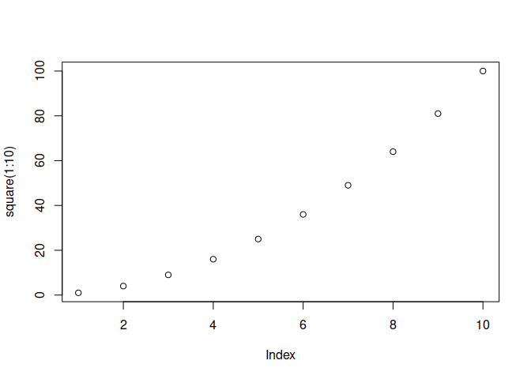

<!-- README.md is generated from README.Rmd. Please edit that file -->

# rpkgtest

<!-- badges: start -->
<!-- badges: end -->

The goal of rpkgtest is to enable me to practice creating an R package.
This package includes a Hello, World function as well as a function to
square numbers.

## Installation

You can install the development version of rpkgtest from
[GitHub](https://github.com/) with:

``` r
# install.packages("devtools")
devtools::install_github("astitz13/rpkgtest")
```

## Example

This is a basic example which shows how this package works:

``` r
library(rpkgtest)
hello()
#> [1] "Hello world!"
```

``` r
square(5)
#> [1] 25
```

You can also plot the square of a range:

``` r
library(rpkgtest)
plot(square(1:10))
```


